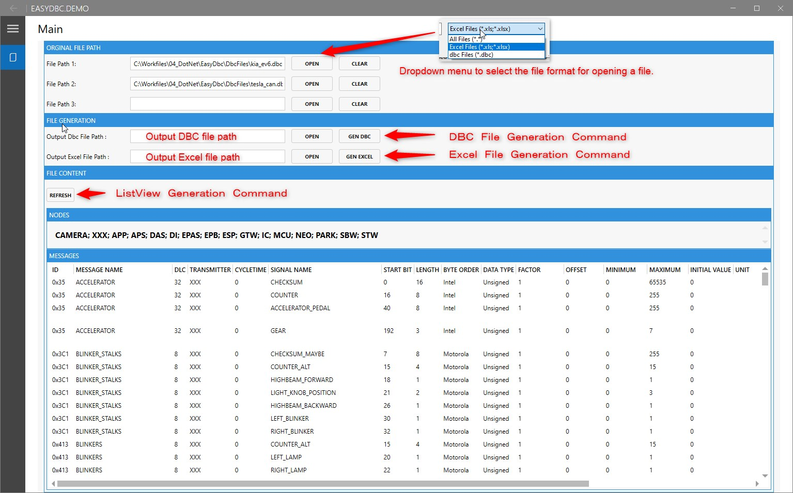
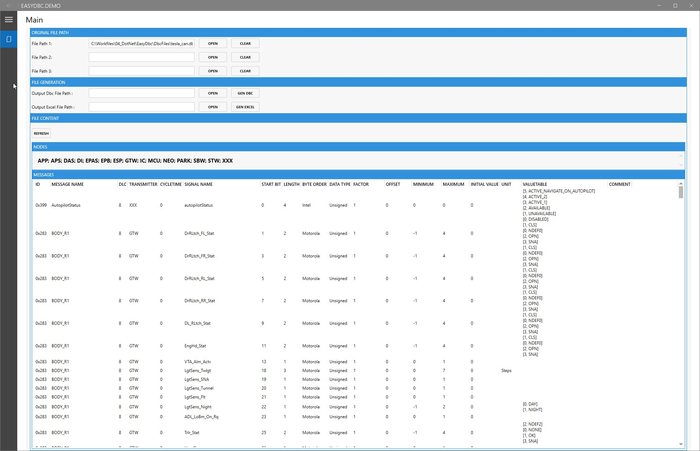

# EasyDbc

<p align="right">
  <a href="./README.en.md">English</a> |
  <a href="./README.zh.md">中文</a> |
  <a href="./README.de.md">Deutsch</a> |
  <a >한국어</a> |
  <a href="./README.jp.md">日本語</a> |
  <a href="./README.fr.md">Français</a>
</p>


## 소개  
이 프로젝트는 [`DbcParserLib`](https://github.com/EFeru/DbcParser)를 기반으로 개발되었으며, 그 위에 다음과 같은 기능을 확장했습니다:

- **DBC 파일 병합**: 여러 DBC 파일을 병합할 수 있는 기능을 지원합니다.
- **DBC 파일 생성**: 요구 사항에 맞는 새로운 DBC 파일을 생성할 수 있습니다.
- **Excel 파일을 DBC로 변환**: Excel 파일을 DBC 파일로 변환하는 기능을 제공하며, 유연한 매핑과 변환을 지원합니다.
- **Excel 파일 생성**: DBC 데이터를 기반으로 Excel 파일을 생성할 수 있습니다.
- **사용자 정의 Excel 분석 및 생성 로직**: Excel 파일을 분석하고 생성하는 데 있어 유연한 사용자 정의 로직을 제공합니다.

이러한 확장 기능들은 프로젝트가 DBC 파일과 Excel 파일을 더 유연하고 효율적으로 처리할 수 있게 해 주며, 차량 네트워크 관리와 신호 처리를 향상시킵니다.


---

## 기능 특성  
- **DBC 파일 분석**: 신호, 메시지 및 노드 정보를 추출할 수 있습니다.  
- **데이터 표시**: 직관적인 사용자 인터페이스를 통해 분석 결과를 보여줍니다.  
- **형식 검증**: 새 형식과 구 형식의 Excel 파일을 유연하게 분석합니다.  
- **확장성**: Excel 파일 분석과 생성 시 유연한 사용자 정의 로직을 제공합니다.  

---

## 플러그인 참조

이 프로젝트에서 Excel 파일 분석 및 생성 기능을 구현할 때, [`NPOI`](https://github.com/dotnetcore/NPOI) 플러그인을 참조했습니다. `NPOI`는 Microsoft Office 형식 파일(Excel, Word, PowerPoint)을 처리할 수 있는 강력하고 사용하기 쉬운 .NET 오픈소스 라이브러리입니다. 특히 Excel 파일의 다양한 요구 사항을 처리하는 데 적합합니다.

이 프로젝트에서는 `NPOI` 플러그인의 다음 기능을 사용했습니다:

- **그룹화**: 데이터를 지정된 규칙에 따라 그룹화하여 더 잘 관리하고 표시합니다.
- **드롭다운 메뉴**: Excel 셀에 드롭다운 메뉴 기능을 구현하여 사용자의 입력을 간소화하고 데이터 일관성을 보장합니다.
- **검증**: `NPOI`의 데이터 검증 기능을 사용하여 Excel 파일 내 데이터가 지정된 규칙에 맞는지 확인합니다.
- **배경색 설정**: Excel 셀의 배경색을 사용자 정의하여 가독성과 시각적 효과를 향상시킵니다.
- **셀 형식 설정**: 숫자 형식, 날짜 형식 등 셀의 형식을 설정하여 데이터가 올바르게 표시되도록 합니다.

`NPOI`를 사용함으로써, 이 프로젝트는 Excel 파일을 더 유연하게 처리하고 복잡한 기능 요구 사항을 실현할 수 있게 되었습니다.


---

# EasyDbc

<p align="right">
  <a href="./README.en.md">English</a> |
  <a href="./README.zh.md">中文</a> |
  <a href="./README.de.md">Deutsch</a> |
  <a href="./README.ko.md">한국어</a> |
  <a href="./README.jp.md">日本語</a> |
  <a href="./README.fr.md">Français</a>
</p>


## 소개  
이 프로젝트는 [`DbcParserLib`](https://github.com/EFeru/DbcParser)를 기반으로 개발되었으며, 그 위에 다음과 같은 기능을 확장했습니다:

- **DBC 파일 병합**: 여러 DBC 파일을 병합할 수 있는 기능을 지원합니다.
- **DBC 파일 생성**: 요구 사항에 맞는 새로운 DBC 파일을 생성할 수 있습니다.
- **Excel 파일을 DBC로 변환**: Excel 파일을 DBC 파일로 변환하는 기능을 제공하며, 유연한 매핑과 변환을 지원합니다.
- **Excel 파일 생성**: DBC 데이터를 기반으로 Excel 파일을 생성할 수 있습니다.
- **사용자 정의 Excel 분석 및 생성 로직**: Excel 파일을 분석하고 생성하는 데 있어 유연한 사용자 정의 로직을 제공합니다.

이러한 확장 기능들은 프로젝트가 DBC 파일과 Excel 파일을 더 유연하고 효율적으로 처리할 수 있게 해 주며, 차량 네트워크 관리와 신호 처리를 향상시킵니다.


---

## 기능 특성  
- **DBC 파일 분석**: 신호, 메시지 및 노드 정보를 추출할 수 있습니다.  
- **데이터 표시**: 직관적인 사용자 인터페이스를 통해 분석 결과를 보여줍니다.  
- **형식 검증**: 새 형식과 구 형식의 Excel 파일을 유연하게 분석합니다.  
- **확장성**: Excel 파일 분석과 생성 시 유연한 사용자 정의 로직을 제공합니다.  

---

## 플러그인 참조

이 프로젝트에서 Excel 파일 분석 및 생성 기능을 구현할 때, [`NPOI`](https://github.com/dotnetcore/NPOI) 플러그인을 참조했습니다. `NPOI`는 Microsoft Office 형식 파일(Excel, Word, PowerPoint)을 처리할 수 있는 강력하고 사용하기 쉬운 .NET 오픈소스 라이브러리입니다. 특히 Excel 파일의 다양한 요구 사항을 처리하는 데 적합합니다.

이 프로젝트에서는 `NPOI` 플러그인의 다음 기능을 사용했습니다:

- **그룹화**: 데이터를 지정된 규칙에 따라 그룹화하여 더 잘 관리하고 표시합니다.
- **드롭다운 메뉴**: Excel 셀에 드롭다운 메뉴 기능을 구현하여 사용자의 입력을 간소화하고 데이터 일관성을 보장합니다.
- **검증**: `NPOI`의 데이터 검증 기능을 사용하여 Excel 파일 내 데이터가 지정된 규칙에 맞는지 확인합니다.
- **배경색 설정**: Excel 셀의 배경색을 사용자 정의하여 가독성과 시각적 효과를 향상시킵니다.
- **셀 형식 설정**: 숫자 형식, 날짜 형식 등 셀의 형식을 설정하여 데이터가 올바르게 표시되도록 합니다.

`NPOI`를 사용함으로써, 이 프로젝트는 Excel 파일을 더 유연하게 처리하고 복잡한 기능 요구 사항을 실현할 수 있게 되었습니다.


---

## 프로젝트 구조  
```plaintext
프로젝트 루트 디렉토리/
├── EasyDbc/                # 소스 코드 폴더
│   ├── Assets/             # 이미지 및 기타 자원
│   ├── Contracts/          # 인터페이스 파일
│   ├── Helpers/            # 확장 기능
│   ├── Models/             # 데이터 모델
│   ├── Observers/          # 오류 처리 클래스
│   ├── Parsers/            # 분석 클래스
│   ├── Generators/         # 파일 생성 클래스
│   └── EasyDbc.csproj      # 프로젝트 파일
├── DbcFiles/               # 리소스 파일
├── EasyDbc.Benchmark/      # 성능 테스트 폴더
├── EasyDbc.Test/           # 단위 테스트 폴더
├── EasyDbc.Demo/           # 예제 프로젝트 폴더
├── README.ko.md            # 한국어 프로젝트 설명 파일
├── README.md               # 프로젝트 설명 파일
└── LICENSE                 # 라이센스 파일

```
---

## 빠른 시작

# 프로그램 실행 예시 Demo

아래는 본 프로젝트의 몇 가지 기능과 실행 효과를 보여주는 스크린샷입니다.

**샘플 설명 스크린샷**:




---

## 기능 1: **DBC 파일 분석**

지정된 경로에서 DBC 파일을 분석하고 내용을 성공적으로 로드합니다.

**실행 효과 스크린샷**:



**설명**:
- 입력: 잘 형성된 DBC 파일을 선택합니다.
- 출력: 파일 내용을 성공적으로 분석하여 신호 목록과 메시지 정보를 표시합니다.

---

## 기능 2: **Excel 파일 분석 및 생성**

Excel 파일을 DBC 데이터 모델로 변환할 수 있으며, 사용자의 요구에 맞는 Excel 파일을 생성할 수 있습니다.

**실행 효과 스크린샷**:


**설명**:
- 기능 특징:
  - 사용자 정의 로직 분석을 지원합니다.
  - 드롭다운 메뉴, 데이터 검증 및 스타일을 포함한 Excel 파일을 유연하게 생성할 수 있습니다.

---

## 기능 3: **DBC 파일 병합**

여러 DBC 파일을 하나로 병합하여 중복 신호와 충돌 문제를 해결합니다.

**실행 효과 스크린샷**:


**설명**:
- 입력: 병합할 여러 DBC 파일.
- 출력: 하나의 병합된 DBC 파일을 생성하며, 맞춤형 병합 규칙을 지원합니다.

---


## 요약

위는 프로젝트의 몇 가지 핵심 기능을 간략히 소개한 것입니다. 관심 있는 기능에 대해 더 자세한 사용 설명을 원하시면 아래 항목을 참조해주세요.

### 네임스페이스 추가
```cs
// DBC 파일과 Excel 파일 생성에 사용
using EasyDbc.Generators;
// 신호의 특별 분석 사용 예: signal.Parent.CycleTime(out var cycleTime);
using EasyDbc.Helpers;
// 모델 연관
using EasyDbc.Models;
// DBC와 Excel 파일 분석에 사용
using EasyDbc.Parsers;
```
---

### 다양한 형식의 파일을 Dbc 클래스로 분석

```cs
private bool TryParsingToFile(string path, out Dbc dbc)
{
    string extension = Path.GetExtension(path)?.ToLower();
    // 파일 경로를 기반으로 DBC 파일을 분석
    if (extension == ".dbc")
    {
        dbc = Parser.ParseFromPath(path);
        if (dbc != null)
        {
            return true;
        }
        return true;
    }
    else if (extension == ".xls" || extension == ".xlsx")
    {
        // 파일 경로를 기반으로 EXCEL 파일을 분석
        ExcelParser excelParser = new ExcelParser();
        ExcelParserState result = excelParser.ParseFirstSheetFromPath(path, out Dbc dbcOutput);
        if (result == ExcelParserState.Success)
        {
            dbc = dbcOutput;
            return true;
        }
    }
    dbc = null;
    return false;
}

```
---

### DBC 병합 기능 시연, 실제 요구 사항에 맞게 추가 가능

**⚠️ 중요 알림**

현재의 DBC 병합 기능에서는 동일한 메시지가 있을 경우, 먼저 추가된 메시지가 유효하고 그 후에 추가된 메시지는 무효가 됩니다.

```cs
private bool ParsingAndMergeDbc()
{
    Nodes = string.Empty;
    Messages.Clear();
    _mergedDbc = null;
    List<Dbc> parsingResult = new List<Dbc>();
    if (!string.IsNullOrEmpty(FilePath1))
    {
        if (TryParsingToFile(FilePath1, out Dbc dbc))
        {
            parsingResult.Add(dbc);
        }
    }
    if (!string.IsNullOrEmpty(FilePath2))
    {
        if (TryParsingToFile(FilePath2, out Dbc dbc))
        {
            parsingResult.Add(dbc);
        }
    }
    if (!string.IsNullOrEmpty(FilePath3))
    {
        if (TryParsingToFile(FilePath3, out Dbc dbc))
        {
            parsingResult.Add(dbc);
        }
    }
    bool result = DbcGenerator.MergeDbc(parsingResult, out _mergedDbc);
    if (result)
    {
        foreach (Node node in _mergedDbc.Nodes)
        {
            Nodes = string.Join("; ", _mergedDbc.Nodes.Select(node => node.Name));
        }
    }
    return result;
}

```
---
### **DBC 파일解析**
정적 클래스 `Parser`를 사용하여 DBC 파일을 분석합니다. 다음 중 하나의 분석 방식을 선택할 수 있습니다:

```cs
// 파일 경로를 통해 분석
Dbc dbc = Parser.ParseFromPath("C:\\your_dbc_file.dbc");

// 스트림을 통해 파일 분석
Dbc dbc = Parser.ParseFromStream(File.OpenRead("C:\\your_dbc_file.dbc"));

// 텍스트 문자열을 통해 분석
Dbc dbc = Parser.Parse("a dbc as string");

```
---

### **DBC 파일 객체 처리**

`DBC` 객체는 두 개의 컬렉션인 `Messages`와 `Nodes`를 포함합니다. 이들 모두 `IEnumerable<T>` 유형이므로 표준 LINQ를 사용하여 접근, 반복 및 쿼리할 수 있습니다.

예를 들어, ID가 100보다 크고 신호 수가 2보다 많은 메시지를 가져오는 방법은 다음과 같습니다:
```cs
var filteredSelection = dbc
			.Messages
			.Where(m => m.ID > 100 && m.Signals.Count > 2)
			.ToArray();

```
---

### **파싱 오류 관리**

파싱 과정에서 발생한 구문 오류를 사용자에게 알리는 데 사용됩니다.  
`IParseFailureObserver` 인터페이스는 구문 오류를 처리하는 모든 방법을 제공합니다. 예를 들어:
- 일반적인 구문 오류 (예: `;`, `'`, `,` 누락)
- 중복된 객체 정의 (예: 동일한 ID를 가진 메시지; 동일한 이름을 가진 노드, 신호, 사용자 정의 속성 등)
- 객체 정의 누락 (예: 사용자 정의 속성이 선언되기 전에 할당됨)
- 값 일관성 (예: 사용자 정의 속성 값이 속성 정의에서 지정된 최소값과 최대값 범위를 벗어남)

이 라이브러리는 두 가지 다른 구현을 제공합니다:

1. SilentFailureObserver: 기본 구현입니다. 파싱 시 오류를 무시합니다.
2. SimpleFailureObserver: 간단한 옵저버로, 발생한 모든 오류를 기록합니다. `SimpleFailureObserver`의 오류 목록:
    - Unknown syntax: 해당 TAG에 대한 구문이 없음
    - [TAG] Syntax error: 구문 오류, 특정 TAG의 구문 오류
    - Duplicated object: 파서가 중복된 객체를 발견하고 이를 무시함
    - Object Not found: 객체가 정의되기 전에 선언되거나 참조됨
    - Property value out of bound: 속성에 할당된 값이 속성 정의의 최소값/최대값을 벗어남
    - Property value out of index: 선언된 인덱스 값이 허용되지 않음 (값에 인덱스를 통해 접근할 수 있는 속성에 대해)

오류 목록은 `GetErrorList()` 메서드를 통해 확인할 수 있습니다.
```cs
    // 이 두 줄의 코드를 주석 처리하면 오류 파싱 관리가 비활성화됩니다 (오류가 무시됨)
    // 사용자 정의 오류 파싱 관리가 필요하면 IParseFailureObserver 구현을 제공할 수 있습니다
    var failureObserver = new SimpleFailureObserver();
    Parser.SetParsingFailuresObserver(failureObserver);

    var dbc = Parser.ParseFromPath(filePath);
    var errors = failureObserver.GetErrorList();

```
---

### 신호의 패킹과 언패킹

### **간단한 예시**

신호를 패킹하고 언패킹하려면 정적 클래스 `Packer`를 사용할 수 있습니다.  
신호를 패킹/언패킹하는 예시: 14 비트, 최소값: `-61.92`, 최대값: `101.91`

```cs
Signal sig = new Signal
{
  sig.Length = 14,
  sig.StartBit = 2,
  sig.IsSigned = 1,
  sig.ByteOrder = 1, // 0 = Big Endian (Motorola), 1 = Little Endian (Intel)
  sig.Factor = 0.01,
  sig.Offset = 20
};

// 신호를 패킹하여 전송
ulong TxMsg = Packer.TxSignalPack(-34.3, sig);

// 수신된 신호를 언패킹하고 해당 물리적 값을 계산
double val = Packer.RxSignalUnpack(TxMsg, sig);

```

CAN 전송 전에 여러 신호를 패킹할 수 있습니다:

```cs
ulong TxMsg = 0;
TxMsg |= Packer.TxSignalPack(value1, sig1);
TxMsg |= Packer.TxSignalPack(value2, sig2);
TxMsg |= Packer.TxSignalPack(value3, sig3);
// ...
// TxMsg를 CAN 버스로 전송.

```

사용자는 신호가 서로 겹치지 않도록 `Length`와 `StartBit`를 올바르게 지정해야 합니다.

### **복합(Multiplexing) 신호 응용 예시**
하나의 메시지에는 복합 데이터를 포함할 수 있으며, 즉 레이아웃은 복합기 값에 따라 달라질 수 있습니다. `Packer` 클래스는 복합 처리를 할 수 없으므로, 사용자가 주어진 메시지가 실제로 해당 신호를 포함하는지 직접 확인해야 합니다.

예를 들어, 다음과 같은 dbc 파일 내용을 고려해 보겠습니다:

```
BO_ 568 UI_driverAssistRoadSign: 8 GTW
 SG_ UI_roadSign M : 0|8@1+ (1,0) [0|0] ""  DAS
 SG_ UI_dummyData m0 : 8|1@1+ (1,0) [0|0] "" Vector__XXX
 SG_ UI_stopSignStopLineDist m1 : 8|10@1+ (0.25,-8) [-8|247.5] "m" Vector__XXX
```

신호 `UI_dummyData`는 `UI_roadSign` 값이 0일 때만 사용할 수 있으며, `UI_stopSignStopLineDist`는 `UI_roadSign` 값이 1일 때만 사용할 수 있습니다.
복합 정보를 접근하려면 다음 방법을 호출할 수 있습니다:
```cs
var multiplexingInfo = signal.MultiplexingInfo();
if(multiplexingInfo.Role == MultiplexingRole.Multiplexor)
{
    // 복합기입니다!
}
else if(multiplexingInfo.Role == MultiplexingRole.Multiplexed)
{
    Console.WriteLine($"이 신호는 복합 신호이며, 복합기 값이 {multiplexingInfo.Group}일 때 사용할 수 있습니다.");
}

```
확장 메서드를 호출하여 메시지가 복합 신호를 포함하는지 확인할 수도 있습니다.

```cs
if(message.IsMultiplexed())
{
	// ...
}
```
---
# 기여

기여를 환영합니다! 이 라이브러리를 개선하기 위해 언제든지 풀 리퀘스트(pull requests)를 제출해 주세요.

---