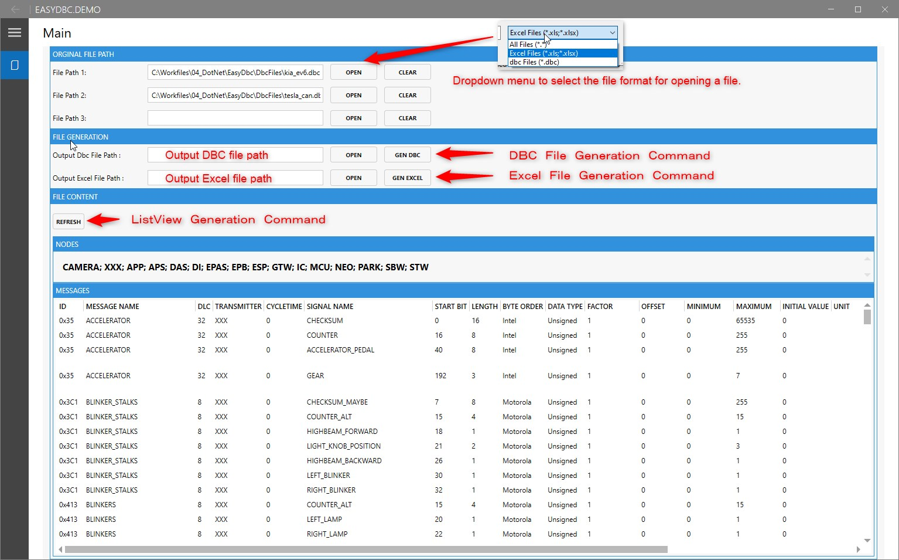
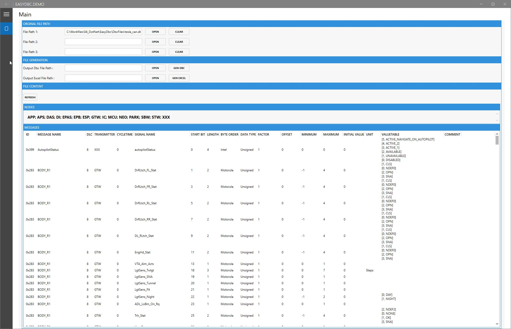
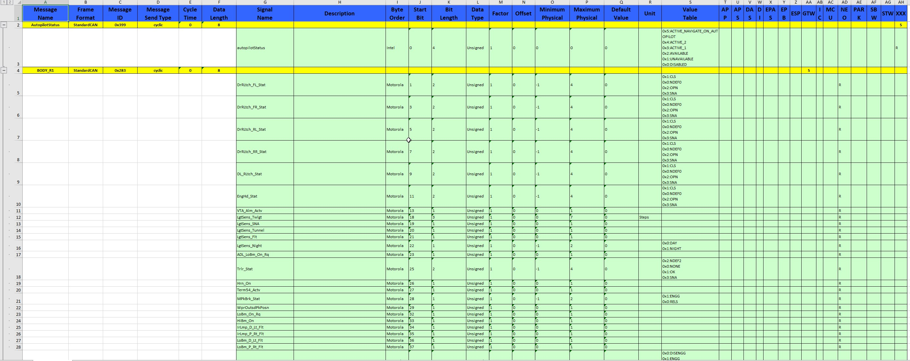
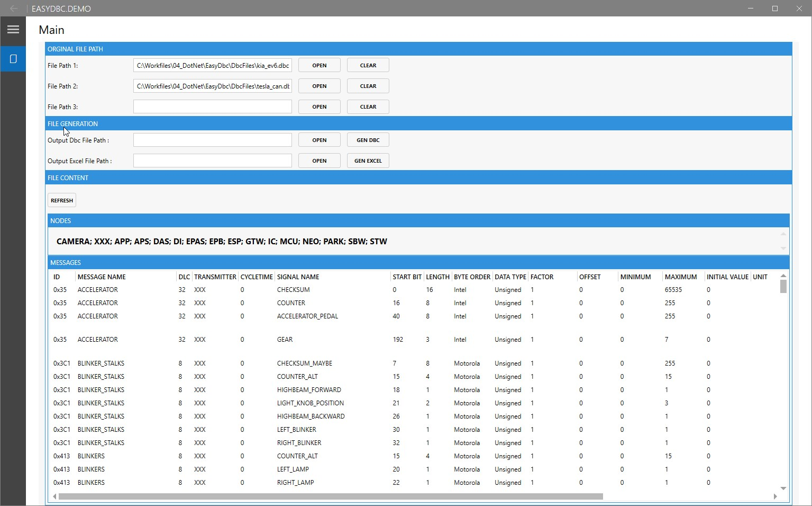

# EasyDbc

<p align="right">
  <a href="./README.en.md">English</a> |
  <a href="./README.zh.md">中文</a> |
  <a href="./README.de.md">Deutsch</a> |
  <a href="./README.kr.md">한국어</a> |
  <a href="./README.jp.md">日本語</a> |
  <a >Français</a>
</p>


## Introduction  
Brève présentation des fonctionnalités et des objectifs du projet.  
Ce projet est développé sur la base de [`DbcParserLib`](https://github.com/EFeru/DbcParser), avec les fonctionnalités étendues suivantes :

- **Fusion de fichiers DBC** : Prend en charge la fusion de plusieurs fichiers DBC.
- **Génération de fichiers DBC** : Permet de générer de nouveaux fichiers DBC en fonction des besoins.
- **Analyse de fichiers Excel en DBC** : Fournit une fonctionnalité pour analyser des fichiers Excel en fichiers DBC, avec des mappages et conversions flexibles.
- **Génération de fichiers Excel** : Prend en charge la génération de fichiers Excel à partir de données DBC.
- **Logique de personnalisation pour l’analyse et la génération Excel** : Fournit une logique personnalisable pour répondre aux besoins spécifiques en matière d’analyse et de génération Excel.

Ces fonctionnalités étendues permettent au projet de traiter les fichiers DBC et Excel de manière plus flexible et efficace, améliorant ainsi la gestion des réseaux de véhicules et le traitement des signaux.

---

## Fonctionnalités  
- **Analyse de fichiers DBC** : Permet d'extraire des informations sur les signaux, les messages et les nœuds.  
- **Affichage des données** : Affiche les résultats de l'analyse de manière interactive et intuitive.  
- **Validation des formats** : Analyse flexible des nouveaux et anciens formats Excel.  
- **Extensibilité** : Analyse et génération de fichiers Excel avec une logique personnalisable.  

---
## Références des plugins  

Ce projet utilise le plugin [`NPOI`](https://github.com/dotnetcore/NPOI) pour l'analyse et la génération de fichiers Excel. `NPOI` est une bibliothèque open-source .NET, utilisée pour traiter les fichiers Microsoft Office (y compris Excel, Word et PowerPoint). Ce plugin est puissant, facile à utiliser, et particulièrement adapté aux divers besoins liés aux fichiers Excel.  

Dans ce projet, les fonctionnalités suivantes de `NPOI` ont été utilisées :  

- **Regroupement** : Permet de regrouper les données selon des règles spécifiques, pour une meilleure présentation et gestion.  
- **Menu déroulant** : Implémente des menus déroulants dans les cellules Excel, simplifiant les saisies utilisateur et assurant la cohérence des données.  
- **Validation** : Utilise la validation des données pour garantir que les données des fichiers Excel respectent les règles spécifiées.  
- **Configuration des couleurs de fond** : Permet de personnaliser les couleurs de fond des cellules Excel pour une meilleure lisibilité et un effet visuel amélioré.  
- **Formatage des cellules** : Prend en charge la configuration des formats de cellules (numériques, dates, etc.), assurant une présentation correcte des données.  

Grâce à `NPOI`, ce projet est capable de traiter les fichiers Excel avec flexibilité, réalisant des exigences fonctionnelles complexes et améliorant la capacité de traitement des données.

---

## Structure du projet  
```plaintext
Répertoire racine du projet/
├── EasyDbc/                # Dossier de code source
│   ├── Assets/             # Ressources supplémentaires (images, etc.)
│   ├── Contracts/          # Interfaces
│   ├── Helpers/            # Extensions
│   ├── Models/             # Modèles de données
│   ├── Observers/          # Classes d'erreurs
│   ├── Parsers/            # Classes d'analyse
│   ├── Generators/         # Classes de génération de fichiers
│   └── EasyDbc.csproj      # Fichier du projet
├── DbcFiles/               # Fichiers de ressources
├── EasyDbc.Benchmark/      # Dossier des tests de performance
├── EasyDbc.Test/           # Dossier des tests unitaires
├── EasyDbc.Demo/           # Dossier des projets de démonstration
├── README.zh_CN.md         # Fichier de documentation en chinois
├── README.md               # Fichier de documentation
└── LICENSE                 # Fichier de licence
```
---

# Démarrage rapide

## Démonstration du fonctionnement du programme

Voici quelques démonstrations des fonctionnalités et des résultats d'exécution du projet.

**Capture d'écran des explications d'exemples**:



---

## Fonctionnalité 1: **Analyse de fichiers DB**

Analysez les fichiers DBC en spécifiant leur chemin, et chargez leur contenu avec succès.

**Capture d'écran des résultats d'exécution**:


**Description de l'exemple**:
- Entrée : Sélectionnez un fichier DBC au format valide.
- Sortie : Analyse réussie du contenu du fichier, affichant la liste des signaux et les informations des messages.

---

## Fonctionnalité 2: **Analyse et génération de fichiers Excel**

Prend en charge l'analyse des fichiers Excel en modèle de données DBC, et la génération de fichiers Excel selon les besoins de l'utilisateur.

**Capture d'écran des résultats d'exécution**:


**Description de l'exemple**:
- Points forts de la fonctionnalité:
  - Prend en charge une logique d'analyse personnalisée.
  - Génération flexible de fichiers Excel avec menus déroulants, validations et styles.

---

## Fonctionnalité 3: **Fusion de fichiers DBC**

Fusionne plusieurs fichiers DBC en un seul, en résolvant les conflits et signaux en double.

**Capture d'écran des résultats d'exécution**:


**Description de l'exemple**:
- Entrée : Plusieurs fichiers DBC à fusionner.
- Sortie : Génération d'un fichier DBC complet fusionné, avec des règles de fusion personnalisables.

---


## Résumé

Les fonctionnalités principales du projet sont décrites ci-dessus. Pour plus de détails sur certaines fonctionnalités spécifiques, veuillez consulter les sections suivantes.

### Ajouter un espace de noms

```cs
// Pour la génération de fichiers DBC et Excel
using EasyDbc.Generators;
// Pour l’analyse spéciale des signaux, par exemple : signal.Parent.CycleTime(out var cycleTime);
using EasyDbc.Helpers;
// Modèles associés
using EasyDbc.Models;
// Pour l’analyse des fichiers DBC et Excel
using EasyDbc.Parsers;
```
---

### Analyse des fichiers dans différents formats en classe Dbc

```cs
private bool TryParsingToFile(string path, out Dbc dbc)
{
    string extension = Path.GetExtension(path)?.ToLower();
    // Analyse du fichier DBC basé sur le chemin du fichier
    if (extension == ".dbc")
    {
        dbc = Parser.ParseFromPath(path);
        if (dbc != null)
        {
            return true;
        }
        return true;
    }
    else if (extension == ".xls" || extension == ".xlsx")
    {
    // Analyse du fichier EXCEL basé sur le chemin du fichier
        ExcelParser excelParser = new ExcelParser();
        ExcelParserState result = excelParser.ParseFirstSheetFromPath(path, out Dbc dbcOutput);
        if (result == ExcelParserState.Success)
        {
            dbc = dbcOutput;
            return true;
        }
    }
    dbc = null;
    return false;
}

```
---

### Fonction de fusion de DBC, à adapter selon vos besoins
**⚠️ Remarque importante** 

Pour la fonction de fusion DBC actuelle, si des messages identiques existent, le premier ajouté est valable, les suivants sont ignorés.

```cs
private bool ParsingAndMergeDbc()
{
    Nodes = string.Empty;
    Messages.Clear();
    _mergedDbc = null;
    List<Dbc> parsingResult = new List<Dbc>();
    if (!string.IsNullOrEmpty(FilePath1))
    {
        if (TryParsingToFile(FilePath1, out Dbc dbc))
        {
            parsingResult.Add(dbc);
        }
    }
    if (!string.IsNullOrEmpty(FilePath2))
    {
        if (TryParsingToFile(FilePath2, out Dbc dbc))
        {
            parsingResult.Add(dbc);
        }
    }
    if (!string.IsNullOrEmpty(FilePath3))
    {
        if (TryParsingToFile(FilePath3, out Dbc dbc))
        {
            parsingResult.Add(dbc);
        }
    }
    bool result = DbcGenerator.MergeDbc(parsingResult, out _mergedDbc);
    if (result)
    {
        foreach (Node node in _mergedDbc.Nodes)
        {
            Nodes = string.Join("; ", _mergedDbc.Nodes.Select(node => node.Name));
        }
    }
    return result;
}

```
---
### **Analyse des fichiers DBC**
Utilisez la classe statique Parser pour analyser les fichiers DBC en choisissant une méthode :
```cs
// Analyse via le chemin du fichier
Dbc dbc = Parser.ParseFromPath("C:\\your_dbc_file.dbc");
// Analyse via un flux de données
Dbc dbc = Parser.ParseFromStream(File.OpenRead("C:\\your_dbc_file.dbc")); 
// Analyse via une chaîne de texte
Dbc dbc = Parser.Parse("a dbc as string");

```
---

### **Gestion de l'objet fichier DBC**

L'objet `DBC` contient deux collections, `Messages` et `Nodes`, qui sont toutes deux de type `IEnumerable<T>`. Vous pouvez donc utiliser LINQ pour accéder, itérer et interroger ces collections.

Par exemple, pour obtenir tous les messages avec un ID supérieur à 100 et contenant plus de 2 signaux :
```cs
var filteredSelection = dbc
			.Messages
			.Where(m => m.ID > 100 && m.Signals.Count > 2)
			.ToArray();
```
---

### **Gestion des erreurs d'analyse**

Utilisé pour signaler à l'utilisateur les erreurs de syntaxe rencontrées pendant l'analyse. 

L'interface `IParseFailureObserver` fournit toutes les méthodes nécessaires pour gérer les erreurs de syntaxe, telles que :
- Erreurs de syntaxe générales (par exemple, ;, ', , manquants)
- Définitions d'objets dupliqués (par exemple, messages avec le même ID ; nœuds, signaux, propriétés personnalisées avec le même nom)
- Définitions d'objets manquantes (par exemple, une propriété personnalisée attribuée avant d'être déclarée)
- Cohérence des valeurs (par exemple, des valeurs de propriété personnalisées en dehors des limites min/max définies)

La bibliothèque propose deux implémentations :

1. SilentFailureObserver:implémentation par défaut. Elle masque les erreurs lors de l'analyse.
2. SimpleFailureObserver:observateur simple qui enregistre toutes les erreurs. 
    
    Liste des erreurs du SimpleFailureObserver :
    - Syntaxe inconnue : pas de syntaxe TAG correspondante
    - [TAG] Erreur de syntaxe : erreur de syntaxe pour un TAG spécifique
    - Objet dupliqué : l'analyseur détecte (et ignore) un objet dupliqué
    - Objet introuvable : un objet est déclaré ou référencé avant d'être défini
    - Valeur de propriété hors limite : la valeur attribuée est inférieure/supérieure aux limites définies
    - Valeur de propriété hors index : la valeur d'index déclarée est invalide (pour les propriétés avec accès par index, comme les valeurs d'énumération)

La liste des erreurs peut être obtenue via la méthode GetErrorList().
```cs
    // Commentez ces lignes pour désactiver la gestion des erreurs (les erreurs seront silencieuses)
    // Vous pouvez fournir votre propre implémentation de IParseFailureObserver pour personnaliser la gestion des erreurs
    var failureObserver = new SimpleFailureObserver();
    Parser.SetParsingFailuresObserver(failureObserver);

    var dbc = Parser.ParseFromPath(filePath);
    var errors = failureObserver.GetErrorList();

```
---

### Encodage et décodage des signaux

### **Exemple simple d'application**

Pour encoder et décoder des signaux, utilisez la classe statique `Packer`. 

Exemple d'encodage/décodage pour un signal de 14 bits, avec une valeur minimale de `-61.92` et maximale de `101.91` :

```cs
Signal sig = new Signal
{
  sig.Length = 14,
  sig.StartBit = 2,
  sig.IsSigned = 1,
  sig.ByteOrder = 1, // 0 = Big Endian (Motorola), 1 = Little Endian (Intel)
  sig.Factor = 0.01,
  sig.Offset = 20
};

// Pour encoder et envoyer un signal
ulong TxMsg = Packer.TxSignalPack(-34.3, sig);

// Pour décoder un signal reçu et calculer la valeur physique correspondante
double val = Packer.RxSignalUnpack(TxMsg, sig);

```

Avant de transmettre via le bus CAN, vous pouvez encoder plusieurs signaux dans un message :
```cs
ulong TxMsg = 0;
TxMsg |= Packer.TxSignalPack(value1, sig1);
TxMsg |= Packer.TxSignalPack(value2, sig2);
TxMsg |= Packer.TxSignalPack(value3, sig3);
// ...
// Envoyez TxMsg sur le bus CAN.

```

L'utilisateur doit s'assurer que les signaux ne se chevauchent pas en spécifiant correctement `Length` et `StartBit`.

### **Exemple d'application de signaux multiplexés**
Un message peut inclure des données multiplexées, où la disposition change en fonction de la valeur du multiplexeur. 
La classe `Packer` ne prend pas en charge le multiplexage, l'utilisateur doit donc vérifier manuellement si le message donné contient effectivement ce signal.

Par exemple, considérez le contenu suivant dans un fichier dbc :
```
BO_ 568 UI_driverAssistRoadSign: 8 GTW
 SG_ UI_roadSign M : 0|8@1+ (1,0) [0|0] ""  DAS
 SG_ UI_dummyData m0 : 8|1@1+ (1,0) [0|0] "" Vector__XXX
 SG_ UI_stopSignStopLineDist m1 : 8|10@1+ (0.25,-8) [-8|247.5] "m" Vector__XXX
```

Le signal `UI_dummyData` est disponible uniquement lorsque `UI_roadSign` vaut 0, et `UI_stopSignStopLineDist` est disponible uniquement lorsque `UI_roadSign` vaut 1. 

Vous pouvez accéder aux informations de multiplexage avec l'appel suivant :
```cs
var multiplexingInfo = signal.MultiplexingInfo();
if(multiplexingInfo.Role == MultiplexingRole.Multiplexor)
{
	// C'est un multiplexeur !
}
else if(multiplexingInfo.Role == MultiplexingRole.Multiplexed)
{
	Console.WriteLine($"Ce signal est multiplexé et sera disponible lorsque la valeur du multiplexeur est {multiplexingInfo.Group}");
}
```
Vous pouvez également vérifier si un message contient des signaux multiplexés avec une méthode d'extension.
```cs
if(message.IsMultiplexed())
{
	// ...
}
```
---
# Contribution

Les contributions sont les bienvenues ! N'hésitez pas à soumettre des pull requests pour améliorer cette bibliothèque.

---