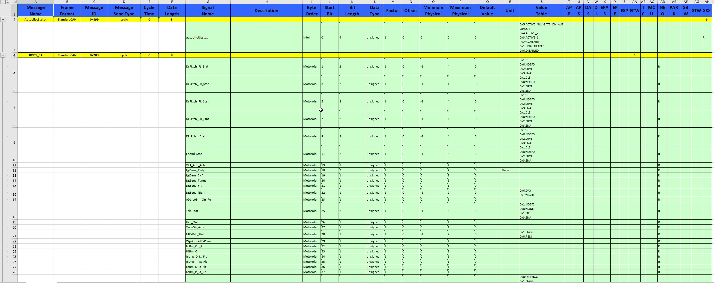

# EasyDbc

<p align="right">
  <a href="./README.en.md">English</a> |
  <a href="./README.zh.md">中文</a> |
  <a href="./README.de.md">Deutsch</a> |
  <a href="./README.kr.md">한국어</a> |
  <a >日本語</a> |
  <a href="./README.fr.md">Français</a>
</p>


## 概要  
プロジェクトの機能と目標を簡単に紹介します。  
このプロジェクトは [`DbcParserLib`](https://github.com/EFeru/DbcParser) を基に開発され、以下の機能が拡張されています：

- **DBCファイルの結合**：複数のDBCファイルの結合操作をサポート。
- **DBCファイル生成機能**：ニーズに応じて新しいDBCファイルを生成可能。
- **ExcelファイルをDBCに変換**：ExcelファイルをDBCファイルに変換する機能を提供し、柔軟なマッピングと変換をサポート。
- **Excelファイル生成**：DBCデータからExcelファイルを生成可能。
- **カスタムExcel解析と生成ロジック**：Excelファイル解析と生成において柔軟なカスタマイズロジックを提供し、さまざまなニーズに対応。

これらの拡張機能により、プロジェクトはDBCファイルとExcelファイルをより柔軟かつ効率的に処理でき、車両ネットワーク管理と信号処理能力が向上します。

---

## 機能の特徴  
- **DBCファイルの解析**：信号、メッセージ、ノード情報の抽出をサポート。  
- **データ表示**：インタラクティブなインターフェイスで解析結果を直感的に表示。  
- **フォーマット検証**：新旧形式のExcel解析を柔軟にサポート。  
- **拡張性**：Excelファイル解析と生成において柔軟なカスタマイズロジックを提供。  

---
## 参照プラグイン  

本プロジェクトでExcel解析と生成機能を実現する際、[`NPOI`](https://github.com/dotnetcore/NPOI) プラグインを参考にしました。  
`NPOI`は、Microsoft Office形式のファイル（Excel、Word、PowerPointを含む）を処理するためのオープンソース.NETライブラリです。このプラグインは機能が豊富で使いやすく、特にExcelファイルの処理ニーズに適しています。

本プロジェクトでは、`NPOI`プラグインの以下の機能を主に使用しました：

- **グループ化**：データを指定ルールに従ってグループ化し、管理と表示を効率化。
- **ドロップダウンメニュー**：Excelセル内のドロップダウンメニュー機能を実現し、入力を簡素化しデータの一貫性を確保。
- **データ検証**：`NPOI`のデータ検証機能を利用し、Excelファイル内のデータが指定ルールに準拠していることを確認。
- **背景色設定**：Excelセルの背景色をカスタマイズし、可読性と視覚効果を向上。
- **セルフォーマット設定**：数字フォーマットや日付フォーマットなど、セルフォーマットを設定可能でデータ表示を適切に制御。

`NPOI`を使用することで、本プロジェクトはExcelファイルを柔軟に処理し、複雑な機能要件を満たし、データ処理能力を向上させました。

---

## プロジェクト構造  
```plaintext
プロジェクトルートディレクトリ/
├── EasyDbc/                # ソースコードフォルダ
│   ├── Assets/             # 画像などの追加リソース
│   ├── Contracts/          # インターフェースファイル
│   ├── Helpers/            # 拡張機能
│   ├── Models/             # データモデル
│   ├── Observers/          # エラー関連
│   ├── Parsers/            # 解析クラス
│   ├── Generators/         # ファイル生成クラス
│   └── EasyDbc.csproj      # プロジェクトファイル
├── DbcFiles/               # リソースファイル
├── EasyDbc.Benchmark/      # 性能テストフォルダ
├── EasyDbc.Test/           # 単体テストフォルダ
├── EasyDbc.Demo/           # サンプルプロジェクトフォルダ
├── README.zh_CN.md         # 中国語プロジェクト説明ファイル
├── README.md               # プロジェクト説明ファイル
└── LICENSE                 # ライセンスファイル
```
---

# クイックスタート

## プログラムの実行デモ

以下は本プロジェクトのいくつかの機能と実行効果のスクリーンショットです。

**使用説明のサンプルスクリーンショット**：


---

## 機能1: **DBCファイル解析**

指定されたパスからDBCファイルを解析し、内容を正常にロードします。

**実行効果のスクリーンショット**：


**サンプル説明**：
- 入力：適切な形式のDBCファイルを選択。
- 出力：ファイル内容を解析して信号リストとメッセージ情報を表示。

---

## 機能2: **Excelファイルの解析と生成**

ExcelファイルをDBCデータモデルに解析し、ユーザーのニーズに応じてExcelファイルを生成可能。

**実行効果のスクリーンショット**：



**サンプル説明**：
- 機能の特徴：
  - カスタムロジックによる解析をサポート。
  - ドロップダウンメニュー、データ検証、スタイルを含むExcelファイルを柔軟に生成可能。

---

## 機能3: **DBCファイルの結合**

複数のDBCファイルを1つに結合し、信号の重複や衝突問題を解決。

**実行効果のスクリーンショット**：


**サンプル説明**：
- 入力：結合対象の複数のDBCファイル。
- 出力：結合ルールに基づいて生成された完全なDBCファイル。

---


## 結論

上記はプロジェクトの主要な機能の一部です。
特定の機能に興味がある場合は、以下のセクションを参照して詳細な使用方法をご覧ください。

### 名前空間の追加

```cs
// DBCファイルとExcelファイルの生成に使用
using EasyDbc.Generators;
// 信号の特別な解析に使用 例: signal.Parent.CycleTime(out var cycleTime);
using EasyDbc.Helpers;
// 関連モデル
using EasyDbc.Models;
// DBCファイルおよびExcelファイルの解析に使用
using EasyDbc.Parsers;
```
---

### 異なる形式のファイルを解析してDbcクラスに変換

```cs
private bool TryParsingToFile(string path, out Dbc dbc)
{
    string extension = Path.GetExtension(path)?.ToLower();
    // ファイルパスに基づきDBCファイルを解析
    if (extension == ".dbc")
    {
        dbc = Parser.ParseFromPath(path);
        if (dbc != null)
        {
            return true;
        }
        return true;
    }
    else if (extension == ".xls" || extension == ".xlsx")
    {
        // ファイルパスに基づきExcelファイルを解析
        ExcelParser excelParser = new ExcelParser();
        ExcelParserState result = excelParser.ParseFirstSheetFromPath(path, out Dbc dbcOutput);
        if (result == ExcelParserState.Success)
        {
            dbc = dbcOutput;
            return true;
        }
    }
    dbc = null;
    return false;
}

```
---

### DBCのマージ機能のデモ（必要に応じてカスタマイズ可能）
**⚠️ 重要な注意事項** 

現在のDBCマージ機能では、同じメッセージがある場合、最初に追加されたものが有効で、それ以降は無効となります。

```cs
private bool ParsingAndMergeDbc()
{
    Nodes = string.Empty;
    Messages.Clear();
    _mergedDbc = null;
    List<Dbc> parsingResult = new List<Dbc>();
    if (!string.IsNullOrEmpty(FilePath1))
    {
        if (TryParsingToFile(FilePath1, out Dbc dbc))
        {
            parsingResult.Add(dbc);
        }
    }
    if (!string.IsNullOrEmpty(FilePath2))
    {
        if (TryParsingToFile(FilePath2, out Dbc dbc))
        {
            parsingResult.Add(dbc);
        }
    }
    if (!string.IsNullOrEmpty(FilePath3))
    {
        if (TryParsingToFile(FilePath3, out Dbc dbc))
        {
            parsingResult.Add(dbc);
        }
    }
    bool result = DbcGenerator.MergeDbc(parsingResult, out _mergedDbc);
    if (result)
    {
        foreach (Node node in _mergedDbc.Nodes)
        {
            Nodes = string.Join("; ", _mergedDbc.Nodes.Select(node => node.Name));
        }
    }
    return result;
}

```
---
### **DBCファイルの解析**
静的クラス Parser を使用してDBCファイルを解析します。次のいずれかの方法を選択してください：
```cs
// ファイルパスから解析
Dbc dbc = Parser.ParseFromPath("C:\\your_dbc_file.dbc");
// ストリームからファイルを解析
Dbc dbc = Parser.ParseFromStream(File.OpenRead("C:\\your_dbc_file.dbc")); 
// テキスト文字列から解析
Dbc dbc = Parser.Parse("a dbc as string");

```
---

### **DBCオブジェクトの操作**

`DBC` オブジェクトには、`Messages` と `Nodes` の2つのコレクションが含まれています。これらはどちらも `IEnumerable<T>` 型で、標準のLINQを使用してアクセス、反復処理、クエリが可能です。

例: IDが100を超え、かつ信号の数が2を超えるメッセージを取得する：
```cs
var filteredSelection = dbc
			.Messages
			.Where(m => m.ID > 100 && m.Signals.Count > 2)
			.ToArray();
```
---

### **解析エラー管理**

解析中に発生した文法エラーをユーザーに通知するための仕組みです。 

`IParseFailureObserver` インターフェースは、以下を含むすべてのエラーを処理するためのメソッドを提供します：
- 一般的な文法エラー（例: ;、'、, の欠落）
- 重複するオブジェクト定義（例: 同じIDのメッセージ、同じ名前のノードや信号、カスタム属性など）
- オブジェクト定義の欠如（例: カスタム属性が宣言前に割り当てられた場合）
- 値の一貫性（例: カスタム属性値が最小値・最大値範囲を超える）

ライブラリには次の2つの実装が含まれています：

1. SilentFailureObserver：デフォルト実装。解析中にエラーを非表示にします。
2. SimpleFailureObserver：エラーを記録する単純なオブザーバー。

    以下のようなエラーリストが含まれます：
    - Unknown syntax：未知の文法
    - [TAG] Syntax error：文法エラー（特定のTAGに関連するもの）
    - Duplicated object：重複オブジェクト
    - Object Not found：オブジェクトが見つからない
    - Property value out of bound：属性値が範囲外
    - Property value out of index：属性インデックスが無効

エラーリストは GetErrorList() メソッドで取得できます：
```cs
    // エラー解析を削除したい場合は、以下の2行をコメントアウトしてください
    // 独自の IParseFailureObserver 実装を提供することでエラー管理をカスタマイズできます
    var failureObserver = new SimpleFailureObserver();
    Parser.SetParsingFailuresObserver(failureObserver);

    var dbc = Parser.ParseFromPath(filePath);
    var errors = failureObserver.GetErrorList();

```
---

### 信号のパックとアンパック

### **簡単な使用例**

静的クラス `Packer` を使用して信号をパック/アンパックできます。 
14ビット信号、最小値: `-61.92`、最大値: `101.91` の場合：

```cs
Signal sig = new Signal
{
  sig.Length = 14,
  sig.StartBit = 2,
  sig.IsSigned = 1,
  sig.ByteOrder = 1, // 0 = Big Endian (Motorola), 1 = Little Endian (Intel)
  sig.Factor = 0.01,
  sig.Offset = 20
};

// 信号を送信用にパック
ulong TxMsg = Packer.TxSignalPack(-34.3, sig);

// 信号をアンパックし、対応する物理値を計算
double val = Packer.RxSignalUnpack(TxMsg, sig);

```

複数の信号をCAN送信前にパックすることも可能です：
```cs
ulong TxMsg = 0;
TxMsg |= Packer.TxSignalPack(value1, sig1);
TxMsg |= Packer.TxSignalPack(value2, sig2);
TxMsg |= Packer.TxSignalPack(value3, sig3);
// ...
// TxMsgをCANバスに送信。

```

正確に `Length` と `StartBit` を指定することで、信号間の重複を防ぐ必要があります。

### **多重化信号の使用例**
メッセージには多重化されたデータを含めることができ、レイアウトは多重化値によって異なります。
`Packer` クラスは多重化を処理しないため、ユーザー自身で特定のメッセージにその信号が含まれるかを確認する必要があります。

例: 以下のDBCファイル内容を考慮：
```
BO_ 568 UI_driverAssistRoadSign: 8 GTW
 SG_ UI_roadSign M : 0|8@1+ (1,0) [0|0] ""  DAS
 SG_ UI_dummyData m0 : 8|1@1+ (1,0) [0|0] "" Vector__XXX
 SG_ UI_stopSignStopLineDist m1 : 8|10@1+ (0.25,-8) [-8|247.5] "m" Vector__XXX
```

信号 `UI_dummyData` は `UI_roadSign` の値が 0 の場合のみ利用可能で、信号 `UI_stopSignStopLineDist` は値が 1 の場合のみ利用可能です。
多重化情報を取得するには、以下のメソッドを使用します：
```cs
var multiplexingInfo = signal.MultiplexingInfo();
if(multiplexingInfo.Role == MultiplexingRole.Multiplexor)
{
	// これは多重化器です！
}
else if(multiplexingInfo.Role == MultiplexingRole.Multiplexed)
{
	Console.WriteLine($"この信号は多重化されており、多重化器の値が {multiplexingInfo.Group} のとき利用可能です。");
}

```
メッセージが多重化信号を含むかどうかを確認するには、以下の拡張メソッドを使用します：
```cs
if(message.IsMultiplexed())
{
	// ...
}
```
---
# 貢献

ぜひご協力ください！このライブラリを改善するためのプルリクエストを自由に送信してください。

---